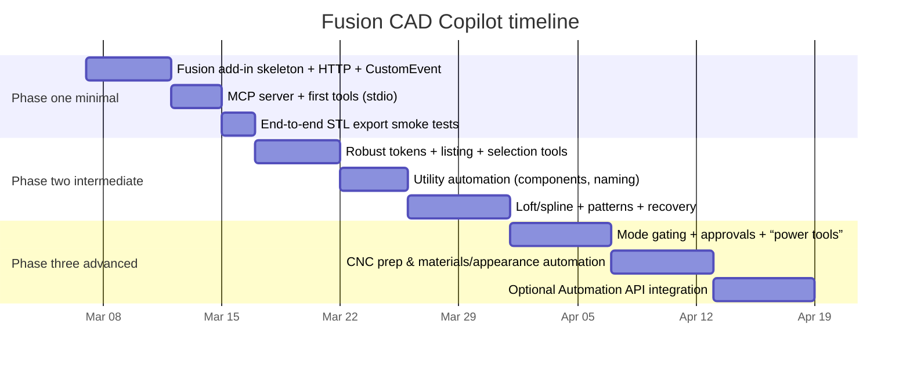

> Reference note: this file is a preserved draft and not a canonical project specification.
> Use the repo root docs for the current source of truth: `README.md`, `PROJECT_CONTEXT.md`, `ARCHITECTURE.md`, and `DEVELOPMENT_PLAN.md`.
# Fusion 360 CAD Copilot on Windows Using a Fusion Add‑In, Local HTTP Bridge, and MCP

## Assumptions, prerequisites, and success criteria

This guide assumes you are on a **Windows** gaming laptop running **Fusion 360 desktop** with the ability to run **Python add-ins** inside Fusion and a separate Python environment for the MCP server. (If you later want the bridge to work on macOS/Linux, the MCP server side is portable; the Fusion add-in side is still “Fusion-desktop dependent.”) citeturn8search0turn7search12

Prerequisites that materially affect success:

- You can create and run a Fusion **add-in** (not just a one-shot script) so it stays resident for the whole Fusion session. Fusion add-ins are loaded/unloaded via `run(context)`/`stop(context)` and can be set to run at startup. citeturn7search12turn8search0  
- You understand the Fusion API’s **ValueInput** pattern: `createByString("15 mm")` respects document units and supports unit-bearing expressions, while `createByReal(…)` uses Fusion internal database units (lengths are centimeters, angles are radians). citeturn7search4turn7search2  
- You accept a key engineering constraint: **most Fusion API calls are not thread-safe**, and Autodesk guidance recommends using **Custom Events** to move work from background threads to Fusion’s main/UI thread. citeturn0search0turn8search15turn8search17  
- You will build a host-agnostic “tool layer” using the **Model Context Protocol (MCP)**, which standardizes tool discovery (`tools/list`) and tool execution (`tools/call`) over either **stdio** (typical for local servers) or **Streamable HTTP** (typical for remote servers). citeturn0search3turn4search13turn4search14  

Success criteria for “very likely to succeed”:

1. A running Fusion add-in exposes a loopback-only local HTTP endpoint (e.g., `127.0.0.1:7432`) and safely executes CAD operations via a CustomEvent dispatcher. citeturn0search0turn4search13turn8search17  
2. A separate MCP stdio server forwards tool calls to that HTTP endpoint and returns structured results. MCP emphasizes typed tool schemas via JSON Schema. citeturn1search0turn4search14turn4search4  
3. At least one end-to-end workflow reaches **STL export** via Fusion’s `ExportManager`. Autodesk publishes an STL export sample. citeturn0search2  

*(Note: A popular community demonstration uses port 7432 for the Fusion-side server; treat the port as configurable to avoid collisions.)* citeturn2search27  

## Architecture and security model

### Core architecture

```mermaid
flowchart LR
  H[Host agent\nClaude / Gemini / Codex / other] -->|MCP stdio\nJSON-RPC 2.0| M[MCP server (Python)\nTools + schemas]
  M -->|HTTP POST 127.0.0.1:<port>| F[Fusion add-in\nHTTP listener thread]
  F -->|enqueue job + fireCustomEvent| UI[Fusion UI thread\nCustomEvent handler]
  UI -->|Fusion API calls| D[Design\nsketches, features, bodies]
  UI -->|result tokens + summaries| F
  F -->|HTTP response| M
  M -->|tool result| H
```

MCP is explicitly designed for “AI app ↔ tools/data” integration with standardized tool schemas and execution semantics across clients. citeturn0search3turn1search28turn4search14  

### Why the Fusion add-in must use a CustomEvent dispatcher

A local HTTP server implies a background thread (or at least a non-UI loop). Autodesk guidance warns that “most (if not all) Fusion API calls are not thread safe” and that some UI calls may crash Fusion; it recommends Custom Events to communicate from worker threads back to the main/UI thread. citeturn0search0turn8search15turn8search17  

Therefore:
- **HTTP thread**: parse request → validate → enqueue job → fire custom event → wait for completion → return JSON.
- **UI thread (CustomEvent handler)**: resolve tokens → call Fusion API → return results/tokens/errors.

This pattern is also reflected in Autodesk forums when users hit crashes with threading and are advised to use CustomEvent to run API operations on the main thread. citeturn0search4turn0search0  

### Entity references: use `entityToken` and `findEntityByToken`

To make cross-process references stable, return **entity tokens** for created entities (sketches, profiles, bodies, features, edges/faces when needed) and re-resolve them later. Fusion docs repeatedly emphasize:

- Token strings can change over time; don’t compare token strings for identity  
- Use `Design.findEntityByToken` to get the actual entity again citeturn6search2turn6search15turn2search10  

This is foundational for reliable “tool-chaining” across many operations.

### Security model and guardrails (must-do)

MCP’s tools specification explicitly states servers MUST validate inputs, implement access controls, rate limit invocations, and sanitize outputs; clients SHOULD request confirmation for sensitive operations and show tool inputs. citeturn4search4turn4search18  

Additionally, when running locally, MCP transport guidance recommends binding to `127.0.0.1` rather than `0.0.0.0` and (for HTTP transports) validating origin headers to mitigate DNS rebinding risks. citeturn4search13  

For a Fusion copilot, treat these as non-negotiable:

- Bind Fusion-side HTTP server to **loopback only** (`127.0.0.1`)  
- Require an **auth token** header (shared secret) for every request (defense-in-depth even on loopback)  
- Restrict **file exports** to an allowlisted directory tree  
- Require host **user approval** for:
  - file writes/exports
  - bulk modifications (rename batches, convert bodies ↔ components)
  - destructive operations (cut/combine/delete)
- Rate limit and cap “job size” (max edges per fillet, max spline points, max pattern instances)

These controls align with MCP’s explicit security considerations around tool invocation. citeturn4search4turn4search0  

## Implementation plan by phase and mode

This plan is intentionally designed to maximize “first success” while growing to broad capability safely. It is organized by **three development passes** and **three usage modes**.

### Timeline overview



Dates are illustrative; treat them as task ordering. MCP servers can be used by many clients; Claude Desktop is used as an example in official guides, but the server remains host-agnostic. citeturn1search1turn1search28  

### Phase one minimal

**Purpose:** Validate the full chain: host → MCP → HTTP → Fusion → STL export, with very small surface area.

**HTTP endpoints required**
- `GET /health`
- `POST /v1/exec` (generic “op router”)

**MCP tools required (minimum)**
- `ping`
- `new_design`
- `create_sketch`
- `sketch_draw_circle`
- `sketch_draw_center_rectangle`
- `sketch_list_profiles`
- `extrude_profile`
- `export_model`

These map directly onto documented Fusion sketch/extrude/export capabilities and patterns shown in Autodesk samples. citeturn5search1turn5search0turn5search2turn0search2  

**Mode-by-mode requirements in phase one**

| Mode | Goals | Required tools (MCP) | Guardrails | Error recovery patterns | Testing checklist | Example prompt + expected call chain |
|---|---|---|---|---|---|---|
| Work | Simple mechanical parts: plate, spacer, bracket; always export STL | `new_design`, `create_sketch`, rectangle/circle draws, `sketch_list_profiles`, `extrude_profile`, `export_model` | Only allow **NewBody** extrudes (no cut/join yet); export path allowlist; require approval for `export_model` | If no profiles: return `NO_PROFILE` and suggest closing sketch loops; if token invalid: require `get_design_summary`/restart sketch | `/health` ok; create sketch on XY; rectangle profile count ≥1; extrude creates a body; STL exists on disk via ExportManager | “Make a 40×20×6mm spacer with Ø5mm hole. Export STL.” → `new_design → create_sketch → draw_center_rectangle → draw_circle → sketch_list_profiles → extrude_profile → export_model` citeturn5search0turn5search1turn5search2turn0search2 |
| Utility | Read-only inspection: “what’s in my design?” | (Optional) `get_design_summary` (if implemented early), otherwise none | No mutation tools; no batch operations | If no active design: return `NO_ACTIVE_DESIGN` | Ensure summary/listing returns quickly; token fields present | “Summarize active design bodies.” → `get_design_summary` |
| Creative | Simple organic via revolve (profile + shell optional); export STL | Same as Work plus `revolve_profile` (optional) | Bounding-box limits; cap spline points; approval for export | If revolve fails: reduce complexity, simplify sketch | Revolve creates body; STL exports | “Make a simple vase (revolve profile), export STL.” → `new_design → create_sketch(XZ) → draw_profile → sketch_list_profiles → revolve_profile → export_model` |

### Phase two intermediate

**Purpose:** Expand to real productivity: listing/selection, controlled subtractive operations, patterns, more organic loft/spline.

**HTTP endpoints required**
- Same `GET /health`, `POST /v1/exec` (plus optional `GET /v1/state` for read-only snapshot)

**Key MCP tools added**
- `get_design_summary`, `list_entities`
- `fillet_edges`, `chamfer_edges`
- `pattern_rectangular`
- `loft_profiles`, `create_construction_plane_offset`
- `convert_bodies_to_components`, `rename_entity`

Fusion API docs cover chamfer/fillet creation patterns and parameters and show patterned features/bodies in sample code; loft sample demonstrates loft creation; ValueInput semantics cover unit expressions. citeturn7search5turn6search0turn5search2turn11search0turn7search4  

**Mode-by-mode requirements in phase two**

| Mode | Goals | Required tools (MCP) | Guardrails | Error recovery patterns | Testing checklist | Example prompt + expected call chain |
|---|---|---|---|---|---|---|
| Work | Typical 3D-print parts: holes, bosses, ribs, edge treatments; modest patterns | Add `fillet_edges`, `chamfer_edges`, `pattern_rectangular` | Allow **cut extrude** only when explicit target bodies are provided; cap pattern instance counts; require confirm for cut/join and heavy patterns | Transactional job result: return partial success + created tokens; re-run `list_entities` after structure changes | Create known body → chamfer edges succeeds; pattern creates correct count; ensure `ValueInput.createByString` works for “mm” expressions | “Make a mounting plate with 4-hole pattern and chamfer 0.6mm.” → `new_design → create_sketch → draw_rectangle/circles → sketch_list_profiles → extrude_profile → chamfer_edges → export_model` citeturn7search5turn7search2turn0search2 |
| Utility | CNC/print prep: convert bodies to components, naming, appearance/material hygiene | Add `convert_bodies_to_components`, `rename_entity`, `set_body_appearance` (optional) | Require approval for bulk operations; limit batch size; record before/after counts | Structure-changing ops invalidate some old entities; always re-list and re-resolve tokens | In a multi-body design: conversion completes; new components names match rule; design remains stable | “Convert bodies to components and prefix names.” → `get_design_summary → list_entities(bodies) → convert_bodies_to_components → rename_entity(batch)` |
| Creative | Decorative pieces: lofted forms, spline-driven shapes, basic variation | Add `create_construction_plane_offset`, `sketch_draw_spline_fit`, `loft_profiles` | Cap spline points (e.g., 50); cap loft sections (e.g., 10); cap model size; require confirm for heavy loft | If loft fails: simplify sections, reorder, reduce curvature, return failing section tokens | Loft sample scenario passes (3 profiles on offset planes); export works | “Loft a lamp shade from 4 profiles then export STL.” → `new_design → plane_offset×N → create_sketch×N → draw_profiles → loft_profiles → export_model` citeturn11search0turn11search9turn0search2 |

### Phase three advanced

**Purpose:** Approach “any kind of design job” by expanding breadth while maintaining mode safety gates, approvals, and reliable recovery.

**Relevant MCP capabilities to leverage**
- Structured tool outputs and strong input validation.
- Clients may implement approval flows; MCP recommends confirmation for sensitive operations. citeturn4search4turn4search18turn4search14  

**Mode-by-mode requirements in phase three**

| Mode | Goals | Required tools (MCP) | Guardrails | Error recovery patterns | Testing checklist | Example prompt + expected call chain |
|---|---|---|---|---|---|---|
| Work | “Serious parts”: multi-body booleans, edits, parameterization, fast iteration; export STL/STEP | Add booleans, parameter tools, advanced selection-by-query, STEP export | Two-tier permissions: “safe tools” auto-approved; “power tools” require approval; preflight checks before destructive ops | Add checkpoints (auto-save or snapshot), then risky ops; return recommended rollback steps | Regression suite of 10 canonical parts; fuzz invalid units/tokens; performance thresholds | “Make an enclosure with lid + bosses + vents, export STL/STEP.” → longer chain using patterns, booleans, appearance/material cleanup |
| Utility | Full pipeline automation: materials/appearance mapping, CAM setup prep, nesting/arrange, + exports | Add material/appearance set tools; CAM setup + post-process tools (if available) | Approval for library access, multi-file export bundles; strict path sandbox; cap CAM operations | If material library lookup fails, degrade gracefully; log mismatches | Test material/appearance sample patterns; confirm BRepBody appearance override works | “Set physical materials to match appearance, convert to components, export STEP.” |
| Creative | Organic exploration: form features, sweeps, thickening, controlled randomness and variants | Add `create_form_feature`, `sweep_profile`, `thicken_surface`, variation tools | Enforce “creative budget” (time, faces, ops); require approval for heavy topology changes | If complexity limit hit: reduce resolution and retry | Creative regression: vase, lampshade, decorative container | “Vibe and create a decorative vase with form feature + shell, export STL.” citeturn11search1turn11search2turn6search1turn0search2 |

## Tool surface and schemas

This section provides: project structure, HTTP contract, recommended first 20 MCP tools (schemas), plus starter code snippets.

### Folder/project structure

Fusion add-ins have a manifest plus Python entrypoint(s) and typically organize feature logic into modules; Autodesk’s Python add-in template describes a multi-module architecture and typical folders. citeturn7search12turn8search0  

Recommended repository layout:

```
fusion-copilot/
  fusion_addin/
    FusionCopilot.manifest
    FusionCopilot.py               # run/stop, server start, event registration
    bridge_http.py                 # HTTP server + request parsing (no Fusion API)
    dispatcher.py                  # queue + CustomEvent dispatcher
    ops/
      sketch_ops.py
      feature_ops.py
      export_ops.py
      utility_ops.py
    logs/
  mcp_server/
    pyproject.toml
    src/fusion_mcp/server.py       # MCP stdio server
    src/fusion_mcp/http_client.py
    src/fusion_mcp/schemas.py
    src/fusion_mcp/guardrails.py
    tests/
  shared/
    examples/
```

### HTTP contract (recommended)

This is a **proposed** contract (not mandated by Autodesk/MCP); it is designed to be stable, debuggable, and safe.

**Endpoints**
- `GET /health` → bridge status
- `POST /v1/exec` → operation router

**`POST /v1/exec` request schema (JSON Schema)**
```json
{
  "type": "object",
  "properties": {
    "requestId": { "type": "string" },
    "mode": { "type": "string", "enum": ["work", "utility", "creative"] },
    "op": { "type": "string" },
    "args": { "type": "object" },
    "dryRun": { "type": "boolean", "default": false }
  },
  "required": ["op", "args", "mode"]
}
```

**Response schema**
```json
{
  "type": "object",
  "properties": {
    "requestId": { "type": "string" },
    "ok": { "type": "boolean" },
    "result": { "type": ["object", "null"] },
    "error": { "type": ["string", "null"] },
    "telemetry": {
      "type": "object",
      "properties": { "durationMs": { "type": "number" } },
      "required": ["durationMs"]
    }
  },
  "required": ["ok", "result", "error"]
}
```

### Recommended first 20 MCP tools with precise input schemas

MCP tools should be schema-defined (JSON Schema) and validated; MCP explicitly frames tools as “typed interfaces” and recommends careful input validation and access controls. citeturn4search14turn4search4  

Below is a practical “first 20” set that covers Work + Utility + Creative across phases one and two (and is a strong base for three).

```json
{
  "tools": [
    {
      "name": "ping",
      "description": "Health check for the Fusion bridge.",
      "inputSchema": { "type": "object", "properties": {}, "required": [] }
    },
    {
      "name": "get_design_summary",
      "description": "Returns active design metadata and entity counts.",
      "inputSchema": {
        "type": "object",
        "properties": { "includeTokens": { "type": "boolean", "default": false } },
        "required": []
      }
    },
    {
      "name": "list_entities",
      "description": "Lists named entities (bodies, components, sketches) and returns entityTokens.",
      "inputSchema": {
        "type": "object",
        "properties": {
          "kind": { "type": "string", "enum": ["bodies", "components", "sketches", "features"] },
          "maxItems": { "type": "integer", "minimum": 1, "maximum": 500, "default": 200 }
        },
        "required": ["kind"]
      }
    },
    {
      "name": "new_design",
      "description": "Create a new Fusion design document.",
      "inputSchema": {
        "type": "object",
        "properties": {
          "documentName": { "type": "string" },
          "units": { "type": "string", "enum": ["mm", "cm", "in"] }
        },
        "required": []
      }
    },
    {
      "name": "create_construction_plane_offset",
      "description": "Creates an offset construction plane from XY/XZ/YZ or an existing plane token.",
      "inputSchema": {
        "type": "object",
        "properties": {
          "basePlane": { "type": "string", "enum": ["xy", "xz", "yz"] },
          "basePlaneToken": { "type": "string" },
          "offset": { "type": "string", "description": "ValueInput string, e.g. '25 mm'." }
        },
        "required": ["offset"]
      }
    },
    {
      "name": "create_sketch",
      "description": "Creates a sketch on a plane.",
      "inputSchema": {
        "type": "object",
        "properties": {
          "plane": { "type": "string", "enum": ["xy", "xz", "yz"] },
          "planeToken": { "type": "string" },
          "name": { "type": "string" }
        },
        "required": []
      }
    },
    {
      "name": "sketch_draw_line",
      "description": "Adds a line to a sketch (2D coordinates in sketch space).",
      "inputSchema": {
        "type": "object",
        "properties": {
          "sketchToken": { "type": "string" },
          "start": { "type": "array", "items": { "type": "number" }, "minItems": 2, "maxItems": 2 },
          "end": { "type": "array", "items": { "type": "number" }, "minItems": 2, "maxItems": 2 }
        },
        "required": ["sketchToken", "start", "end"]
      }
    },
    {
      "name": "sketch_draw_circle",
      "description": "Adds a circle by center + radius.",
      "inputSchema": {
        "type": "object",
        "properties": {
          "sketchToken": { "type": "string" },
          "center": { "type": "array", "items": { "type": "number" }, "minItems": 2, "maxItems": 2 },
          "radius": { "type": "string" }
        },
        "required": ["sketchToken", "center", "radius"]
      }
    },
    {
      "name": "sketch_draw_center_rectangle",
      "description": "Adds a center-point rectangle.",
      "inputSchema": {
        "type": "object",
        "properties": {
          "sketchToken": { "type": "string" },
          "center": { "type": "array", "items": { "type": "number" }, "minItems": 2, "maxItems": 2 },
          "width": { "type": "string" },
          "height": { "type": "string" }
        },
        "required": ["sketchToken", "center", "width", "height"]
      }
    },
    {
      "name": "sketch_draw_spline_fit",
      "description": "Adds a fitted spline through points.",
      "inputSchema": {
        "type": "object",
        "properties": {
          "sketchToken": { "type": "string" },
          "points": {
            "type": "array",
            "items": { "type": "array", "items": { "type": "number" }, "minItems": 2, "maxItems": 2 },
            "minItems": 3,
            "maxItems": 50
          }
        },
        "required": ["sketchToken", "points"]
      }
    },
    {
      "name": "sketch_list_profiles",
      "description": "Lists closed profiles in a sketch and returns profile tokens.",
      "inputSchema": {
        "type": "object",
        "properties": { "sketchToken": { "type": "string" } },
        "required": ["sketchToken"]
      }
    },
    {
      "name": "extrude_profile",
      "description": "Extrudes a profile by distance.",
      "inputSchema": {
        "type": "object",
        "properties": {
          "profileToken": { "type": "string" },
          "distance": { "type": "string" },
          "operation": { "type": "string", "enum": ["new_body", "cut", "join"] },
          "symmetric": { "type": "boolean", "default": false }
        },
        "required": ["profileToken", "distance", "operation"]
      }
    },
    {
      "name": "revolve_profile",
      "description": "Revolves a profile around an axis.",
      "inputSchema": {
        "type": "object",
        "properties": {
          "profileToken": { "type": "string" },
          "axis": { "type": "string", "enum": ["x", "y", "z"] },
          "angle": { "type": "string", "default": "360 deg" },
          "operation": { "type": "string", "enum": ["new_body", "cut", "join"], "default": "new_body" }
        },
        "required": ["profileToken", "axis"]
      }
    },
    {
      "name": "loft_profiles",
      "description": "Lofts through multiple profiles (solid or surface).",
      "inputSchema": {
        "type": "object",
        "properties": {
          "profileTokens": { "type": "array", "items": { "type": "string" }, "minItems": 2, "maxItems": 10 },
          "isSolid": { "type": "boolean", "default": false }
        },
        "required": ["profileTokens"]
      }
    },
    {
      "name": "shell_body",
      "description": "Shells a body to a thickness.",
      "inputSchema": {
        "type": "object",
        "properties": {
          "bodyToken": { "type": "string" },
          "thickness": { "type": "string" },
          "removeFaceTokens": { "type": "array", "items": { "type": "string" }, "default": [] }
        },
        "required": ["bodyToken", "thickness"]
      }
    },
    {
      "name": "fillet_edges",
      "description": "Adds constant-radius fillets to edges.",
      "inputSchema": {
        "type": "object",
        "properties": {
          "edgeTokens": { "type": "array", "items": { "type": "string" }, "minItems": 1, "maxItems": 200 },
          "radius": { "type": "string" },
          "tangentChain": { "type": "boolean", "default": true }
        },
        "required": ["edgeTokens", "radius"]
      }
    },
    {
      "name": "chamfer_edges",
      "description": "Adds equal-distance chamfers to edges.",
      "inputSchema": {
        "type": "object",
        "properties": {
          "edgeTokens": { "type": "array", "items": { "type": "string" }, "minItems": 1, "maxItems": 200 },
          "distance": { "type": "string" },
          "tangentChain": { "type": "boolean", "default": true }
        },
        "required": ["edgeTokens", "distance"]
      }
    },
    {
      "name": "pattern_rectangular",
      "description": "Rectangular pattern of bodies/features along X/Y.",
      "inputSchema": {
        "type": "object",
        "properties": {
          "entityTokens": { "type": "array", "items": { "type": "string" }, "minItems": 1, "maxItems": 20 },
          "xQuantity": { "type": "string" },
          "xDistance": { "type": "string" },
          "yQuantity": { "type": "string" },
          "yDistance": { "type": "string" }
        },
        "required": ["entityTokens", "xQuantity", "xDistance"]
      }
    },
    {
      "name": "convert_bodies_to_components",
      "description": "Converts bodies into components (one body per component) and returns new tokens.",
      "inputSchema": {
        "type": "object",
        "properties": {
          "bodyTokens": { "type": "array", "items": { "type": "string" }, "minItems": 1, "maxItems": 200 },
          "namingRule": { "type": "string", "default": "Component_{index}" }
        },
        "required": ["bodyTokens"]
      }
    },
    {
      "name": "export_model",
      "description": "Exports to STL or STEP using ExportManager.",
      "inputSchema": {
        "type": "object",
        "properties": {
          "format": { "type": "string", "enum": ["stl", "step"] },
          "target": { "type": "string", "enum": ["design", "root_component", "body"] },
          "targetToken": { "type": "string" },
          "path": { "type": "string" },
          "stlBinary": { "type": "boolean", "default": true },
          "stlRefinement": { "type": "string", "enum": ["low", "medium", "high"], "default": "high" }
        },
        "required": ["format", "target", "path"]
      }
    }
  ]
}
```

These tools rely on well-documented Fusion API entrypoints for sketching, profile extraction, extrude/pattern, chamfer/fillet, loft, and ExportManager usage. citeturn5search0turn5search1turn5search2turn7search5turn6search0turn11search0turn0search2  

### Starter code snippet: Fusion add-in (HTTP server + CustomEvent dispatcher)

Fusion add-ins have run/stop entrypoints, and CustomEvent + `Application.fireCustomEvent` is designed for worker thread → main thread signaling. citeturn7search12turn8search17turn8search15  

```python
# FusionCopilot.py (snippet) — keep Fusion API calls on UI thread
import json, threading, time, traceback, uuid
from http.server import BaseHTTPRequestHandler, HTTPServer
import adsk.core, adsk.fusion

EVENT_ID = "fusion_copilot.dispatch"

_app = adsk.core.Application.get()
_ui = _app.userInterface

_lock = threading.Lock()
_jobs = {}  # id -> {"op": str, "args": dict, "done": Event, "result": dict}

_custom_event = None
_handler = None
_httpd = None
_http_thread = None

def _enqueue(op: str, args: dict) -> str:
    rid = str(uuid.uuid4())
    done = threading.Event()
    with _lock:
        _jobs[rid] = {"op": op, "args": args, "done": done, "result": None}
    _app.fireCustomEvent(EVENT_ID, rid)
    return rid

class Dispatcher(adsk.core.CustomEventHandler):
    def notify(self, eventArgs: adsk.core.CustomEventArgs):
        rid = eventArgs.additionalInfo
        with _lock:
            job = _jobs.get(rid)
        if not job:
            return
        t0 = time.time()
        try:
            result = execute_op(job["op"], job["args"])  # your router
            payload = {"ok": True, "result": result, "error": None}
        except Exception:
            payload = {"ok": False, "result": None, "error": traceback.format_exc()}
        payload["telemetry"] = {"durationMs": int((time.time() - t0) * 1000)}
        with _lock:
            job["result"] = payload
            job["done"].set()

class Handler(BaseHTTPRequestHandler):
    def do_GET(self):
        if self.path == "/health":
            self.send_response(200)
            self.send_header("Content-Type", "application/json")
            self.end_headers()
            self.wfile.write(b'{"ok": true, "status": "running"}')
        else:
            self.send_response(404); self.end_headers()

    def do_POST(self):
        if self.path != "/v1/exec":
            self.send_response(404); self.end_headers(); return
        n = int(self.headers.get("Content-Length", "0"))
        req = json.loads(self.rfile.read(n).decode("utf-8"))

        op = req.get("op")
        args = req.get("args") or {}
        mode = req.get("mode", "work")  # use for guardrails

        rid = _enqueue(op, {"mode": mode, **args})

        with _lock:
            done = _jobs[rid]["done"]
        if not done.wait(timeout=60):
            resp = {"requestId": rid, "ok": False, "result": None, "error": "timeout", "telemetry": {"durationMs": 60000}}
        else:
            with _lock:
                payload = _jobs[rid]["result"]
                del _jobs[rid]
            resp = {"requestId": rid, **payload}

        out = json.dumps(resp).encode("utf-8")
        self.send_response(200)
        self.send_header("Content-Type", "application/json")
        self.end_headers()
        self.wfile.write(out)

def run(context):
    global _custom_event, _handler, _httpd, _http_thread
    _custom_event = _app.registerCustomEvent(EVENT_ID)
    _handler = Dispatcher()
    _custom_event.add(_handler)

    _httpd = HTTPServer(("127.0.0.1", 7432), Handler)
    _http_thread = threading.Thread(target=_httpd.serve_forever, daemon=True)
    _http_thread.start()

def stop(context):
    global _httpd
    try:
        if _httpd:
            _httpd.shutdown()
            _httpd.server_close()
    finally:
        _app.unregisterCustomEvent(EVENT_ID)
```

This snippet follows Autodesk’s thread-safety guidance (CustomEvent pattern) and uses the add-in lifecycle entrypoints. citeturn0search0turn8search15turn7search12turn8search17  

### Starter code snippet: MCP server forwarding tools to HTTP

The official MCP Python SDK provides server patterns and explains tool result handling; MCP build-server guidance also warns stdio servers must never log to stdout (use stderr). citeturn1search0turn4search1  

```python
# mcp_server/src/fusion_mcp/server.py (snippet)
import os
import httpx
from mcp.server.fastmcp import FastMCP

FUSION_URL = os.environ.get("FUSION_COPILOT_URL", "http://127.0.0.1:7432")
mcp = FastMCP("fusion_copilot")

async def call_bridge(op: str, args: dict, mode: str) -> dict:
    async with httpx.AsyncClient(timeout=30.0) as client:
        r = await client.post(f"{FUSION_URL}/v1/exec", json={"op": op, "args": args, "mode": mode})
        r.raise_for_status()
        data = r.json()
        if not data.get("ok", False):
            raise RuntimeError(data.get("error") or "bridge error")
        return data["result"]

@mcp.tool()
async def ping() -> dict:
    async with httpx.AsyncClient(timeout=5.0) as client:
        r = await client.get(f"{FUSION_URL}/health")
        r.raise_for_status()
    return {"ok": True}

@mcp.tool()
async def new_design(units: str = "mm") -> dict:
    return await call_bridge("new_design", {"units": units}, mode="work")

@mcp.tool()
async def create_sketch(plane: str = "xy") -> dict:
    return await call_bridge("create_sketch", {"plane": plane}, mode="work")

if __name__ == "__main__":
    mcp.run(transport="stdio")
```

MCP local servers commonly use stdio, and official docs show how local MCP servers are connected to clients (Claude Desktop is used as an example). citeturn1search1turn4search9  

## Observability, testing, and iteration workflow

### Logging and telemetry design

**Fusion add-in logging**
- Log each request (`requestId`, mode, op, durationMs, ok/error) to a rolling JSONL file under `fusion_addin/logs/`.
- Optionally print to Fusion’s Text Command window when in debug mode (Fusion templates explicitly discuss debug logging for development). citeturn7search12  

**MCP server logging**
- For stdio MCP servers: do not print to stdout. MCP build-server guidance explicitly warns stdout logging corrupts JSON-RPC and breaks the server; write to stderr or files. citeturn4search1turn4search5  

**Telemetry**
- Track: tool latency, Fusion op latency, failure codes, and “shape complexity” counters (edges patterned, spline points, faces created).
- If using Codex tooling, note that Codex documents OpenTelemetry export configuration for observability (optional but useful as you scale). citeturn1search15  

### Testing strategy (unit + integration)

Autodesk training materials explicitly discuss structuring add-ins for testability and using both unit and automated integration testing, plus CI-driven packaging. citeturn8search2turn8search5  

**Unit tests (CI-friendly, no Fusion required)**
- MCP tool schemas validate inputs (missing required fields, wrong types).
- HTTP client retries/timeouts and auth header enforcement.
- Guardrails: export path sanitization, mode gating, caps (pattern counts, spline points).

**Integration tests (requires Fusion installed)**
- Add a “Test Runner” command inside the add-in that:
  - creates a new design,
  - runs a fixed recipe (rectangle → extrude → export),
  - asserts invariants (profiles exist, body count incremented, export file exists).
- Run this locally after changes.

**Why CI can’t fully run Fusion by default**
- Fusion desktop is GUI software; fully automated CI execution is possible only with specialized Windows runners and licensing constraints; Autodesk’s guidance on CI in add-in testing focuses more on building, unit tests, and packaging rather than fully headless Fusion execution. citeturn8search5turn8search2  

### Dev workflow on Windows (fast iteration loop)

1. Edit add-in files.
2. In Fusion: open Scripts and Add‑Ins dialog, Stop/Run your add-in to reload changes; Fusion docs describe managing running add-ins in this dialog. citeturn8search0  
3. Debugging: Autodesk’s guidance describes debugging Fusion add-ins with VS Code via the “Debug” option in the Scripts and Add‑Ins dialog. citeturn8search25turn8search0  
4. Run MCP server locally and validate `ping` and a small modeling flow (e.g., spacer).  
5. Repeat until stable.

## Host options and expansion roadmap

### Host options comparison

MCP is designed so the **server** exposes tools; multiple **clients** can connect, making the CAD copilot host-agnostic. citeturn1search28turn0search3  

#### Runtime host comparison (using your MCP server)

| Host | Best for | MCP configuration model | Guardrails & approvals | Practical notes |
|---|---|---|---|---|
| Claude Desktop / Claude Code | Interactive CAD brainstorming + tool chaining | Claude Code docs describe connecting to MCP tools/servers; MCP docs show connecting local servers using Claude Desktop as an example | MCP clients generally support confirmations; MCP docs emphasize approval flows and showing tool inputs for safety | If you use Claude Desktop as the UI, follow MCP local-server connection guidance. citeturn1search5turn4search9turn4search4 |
| Gemini CLI | Terminal-first “agentic” workflows; fast iteration | Configured via `settings.json` under `mcpServers`, including multiple servers and transport choices | Gemini CLI docs discuss server discovery/execution controls and configuration options | Strong for local dev ergonomics; use tool include/exclude to enforce modes. citeturn1search2turn1search10 |
| Codex / ChatGPT workflows | Strong dev+ops patterns, approvals, telemetry | Codex stores MCP server config in `config.toml` and documents MCP setup | Codex documents approvals/sandbox/security guidance and optional telemetry features | Useful if you want stricter “approval gates” and logging options. citeturn1search7turn1search15turn4search4 |

#### Development-assistance comparison (building the copilot)

| Host | Strengths while building | Best use in this project |
|---|---|---|
| Claude Code | Good at refactors and explaining MCP wiring; has dedicated MCP docs | Use for designing tool boundaries and rapid prompt-driven testing of tool chains. citeturn1search5turn1search20 |
| Gemini CLI | Strong config surface for MCP servers; open tooling and terminal workflows | Use for fast local iteration with include/exclude tool and trust settings. citeturn1search2turn1search6 |
| Codex | Strong configuration, approvals/sandboxing concepts, and optional telemetry | Use for building the bridge codebase (tests, packaging, regressions). citeturn1search3turn1search15turn1search7 |

### Three full example workflows (one per mode)

Below are **complete** workflows with expected MCP call chains. Each is compatible with the “first 20 tools” set above (except where noted).

#### Work mode full workflow: printable mounting bracket + STL

Prompt:
> “Design an L‑bracket: base 80×30×5mm, upright 60×30×5mm, fillet inside corner 3mm, add four Ø5.2mm holes (two per face), export STL.”

Expected MCP tool call chain (high level):
1. `new_design(units="mm")`
2. `create_sketch(plane="xy")`
3. `sketch_draw_center_rectangle(... width="80 mm", height="30 mm")` citeturn5search0  
4. `sketch_list_profiles(sketchToken=...)` citeturn10search11  
5. `extrude_profile(profileToken=..., distance="5 mm", operation="new_body")` citeturn5search2turn7search4  
6. `create_construction_plane_offset(basePlane="yz", offset="0 mm")` *(or select a face-based plane later; implementation choice)*
7. `create_sketch(plane="yz")`
8. `sketch_draw_center_rectangle(... width="60 mm", height="30 mm")`
9. `sketch_list_profiles(...)`
10. `extrude_profile(... distance="5 mm", operation="join")` *(Phase two/three because join is destructive-ish)*
11. `fillet_edges(edgeTokens=[...], radius="3 mm")` citeturn6search0turn6search3  
12. hole sketches and `extrude_profile(... operation="cut")` (Phase two/three, with confirmations)
13. `export_model(format="stl", target="design", path="...")` citeturn0search2  

Guardrails invoked:
- require approval for join/cut extrudes, and for export. citeturn4search4  

#### Utility mode full workflow: CNC prep + components + appearance/material hygiene + STEP

Prompt:
> “I’m prepping parts for CNC: convert each body to a component, rename with prefix ‘CNC_’, set body appearance to match my ‘Steel’ appearance, then export STEP.”

Expected MCP tool call chain:
1. `get_design_summary()`
2. `list_entities(kind="bodies")`
3. `convert_bodies_to_components(bodyTokens=[...], namingRule="CNC_{index}")`
4. `list_entities(kind="components")`
5. *(Optional phase two/three tool)* `set_body_appearance(bodyToken=..., appearanceName="Steel")`  
6. `export_model(format="step", target="design", path="...")` citeturn0search2  

Fusion API support notes:
- Fusion exposes material libraries via `Application.materialLibraries`, including references to a “Material API Sample.” citeturn10search0  
- Bodies can have an appearance override applied via a body appearance property (documented on the body object reference). citeturn10search2  
- User-created material/appearance libraries live under a materials path provided by `ApplicationFolders.materialsPath`. citeturn10search6  

#### Creative mode full workflow: lofted lampshade + shell + STL

Prompt:
> “Create a lampshade: height 140mm. Make 4 circular profiles at z=0, 40, 90, 140mm with diameters 70, 85, 60, 90mm. Loft to a surface, thicken to 2.2mm, export STL.”

Expected MCP tool call chain:
1. `new_design(units="mm")`
2. `create_construction_plane_offset(basePlane="xy", offset="0 mm")`
3. `create_sketch(planeToken=plane0)`
4. `sketch_draw_circle(radius="35 mm")`
5. repeat plane/sketch/circle for each z offset
6. `sketch_list_profiles` for each sketch; collect profile tokens citeturn6search2  
7. `loft_profiles(profileTokens=[...], isSolid=false)` (surface loft) citeturn11search9turn11search0  
8. *(Phase three tool)* `thicken_surface(surfaceToken=..., thickness="2.2 mm")` (Fusion has ThickenFeatures API) citeturn6search1  
9. `export_model(format="stl", target="design", path="...")` citeturn0search2  

### Expansion roadmap

This roadmap prioritizes the user’s stated needs: 3D printing productivity on a laptop, broad modeling capability, and later CNC utility.

**CNC prep**
- Add tools for hole/pocket recognition and CAM setup automation where available; Autodesk publishes samples that recognize holes/pockets and create manufacturing operations (requires relevant workspace/extension). citeturn9search11turn5search6  
- For “nesting/arrange” workflows, Fusion has an Arrange feature API in preview; treat preview APIs cautiously for distributed tools. citeturn5search10turn9search9  

**Material and appearance automation**
- Tooling around `Application.materialLibraries`, body appearance overrides, and per-user library paths (`materialsPath`) supports “appearance/material hygiene” tasks like the one you described. citeturn10search0turn10search2turn10search6  

**Lofts, splines, sweeps, forms**
- Loft: official Loft sample and LoftSections API. citeturn11search0turn11search9  
- Sweeps: official SweepFeatures APIs and sample listings (including guide rails and two-rail sweeps). citeturn11search2turn11search4turn11search6  
- Form (T-spline): `FormFeatures.add` exists and is documented. citeturn11search1  

**Automation API integration (cloud expansion)**
- Autodesk’s Automation API for Fusion began as a public beta and has been described as supporting **TypeScript** scripts run in a secure sandbox; Autodesk notes desktop Fusion scripts/add-ins are Python/C++ while the Automation API currently supports TypeScript. citeturn3search3turn3search0  
- A pragmatic integration path is: keep your local MCP copilot for interactive work; use the Automation API for batch jobs (mass parameter sweeps, overnight variant generation, regression rebuilds). Autodesk provides “get started” guidance and developer docs around executing Fusion scripts in the Automation environment. citeturn3search22turn3search14turn3search3  

### Notes on existing third-party examples (AuraFriday)

AuraFriday’s “MCP-Link for Fusion” is listed in the Autodesk App Store as exposing broad Fusion control through MCP, and their GitHub project describes “AI tool access” frameworks; these are useful references for what is possible and for UX patterns, but you should still implement your own safety gates and maintainable schemas for a “very likely to succeed” build. citeturn2search0turn2search1turn2search12  

Also, there is an Autodesk forum announcement thread about “driving Fusion via AI using MCP server add-in,” indicating additional community experimentation and architecture discussion. citeturn2search3  


