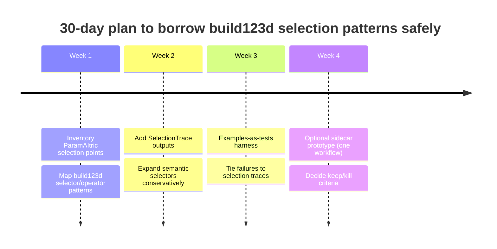

# and Integration Assessment

## Executive Summary

- **Observed:** ParamAItric positions itself as a tool-focused, AI-assisted CAD layer aimed at producing *editable* geometry in Fusion via a constrained MCP workflow interface (validated schemas, ordered stages, verification checkpoints, and STL export from a validated body). citeturn24view0turn24view3  
- **Observed:** ParamAItric’s architecture splits responsibilities across an AI host → MCP-facing server → loopback HTTP bridge → Fusion add-in that executes on the Fusion main thread (via a CustomEvent handler). citeturn5view2turn38view6  
- **Observed:** build123d is a Python CAD-as-code framework built on the Open Cascade BREP kernel, emphasizing a Pythonic API, context managers (“builder mode”), and selector-based topology exploration returning a list-like ShapeList that can be filtered/sorted for downstream operations. citeturn17view0turn6view1turn18view3  
- **Observed overlap:** Both systems invest heavily in (a) deterministic feature construction and (b) reliable selection of topology needed for operations like fillet/chamfer/shell. In ParamAItric, this appears as staged workflows and explicitly selected edge sets (e.g., `apply_fillet` selects an “interior” edge set; `apply_chamfer` supports selectable policies like `interior_bracket` vs `top_outer`). citeturn11view0turn11view1turn34view2turn34view0  
- **Where build123d is materially stronger:** A mature, coherent “modeling DSL” (builder/algebra modes), plus extensible topology selection/filter pipelines (selectors + operators) that are first-class, list-like, and composable. This is directly relevant to improving ParamAItric’s determinism and *explainability* around “which edges/faces did we just pick?” citeturn6view1turn17view0  
- **Where ParamAItric is materially stronger (and should remain the source of truth):** AI-facing orchestration, staged workflow validation, provenance-aware verification tiers, and “operator-in-the-loop” recovery mechanisms like Freeform sessions with commit/rollback/log export. citeturn5view3turn23view0turn24view3turn38view1  
- **Key conclusion (recommended posture):**
  - **Use build123d now as:** **reference + pattern library**, and optionally as a **dev-time aid** for designing/validating deterministic “selection pipelines” and regression invariants. citeturn6view1turn6view3turn17view0  
  - **Avoid using build123d now as:** a **runtime dependency** in the main execution path, because ParamAItric’s core promise is *editable Fusion geometry* produced under a strict, verification-driven contract; swapping kernels/backends risks breaking topology/reference semantics and the guarded workflow surface. citeturn24view0turn5view2turn5view3  
  - **Consider build123d later as:** a **secondary backend candidate only if** ParamAItric defines a backend-neutral “operation IR” and intentionally limits it to a small, testable subset where cross-kernel divergence is acceptable (likely for offline analysis or coarse verification, not for authoring Fusion-native parametric history). citeturn18view3turn24view3turn5view2  

## Capability Comparison Table

| Area | build123d capability | ParamAItric current capability | Who is ahead | Why it matters for the decision |
|---|---|---|---|---|
| Core mission | CAD-as-code BREP modeling for manufacturing outputs (Python-native modeling, export to other CAD tools). citeturn7search16turn17view0 | AI-assisted, tool-driven generation of **editable Fusion geometry** via constrained workflows and verification. citeturn24view0turn24view3 | **Different** (not directly comparable) | They optimize for different “last mile”: build123d for code-native modeling + file exchange; ParamAItric for controlled AI → Fusion history/editability. citeturn17view0turn24view0 |
| Kernel / geometry engine | Built on the Open Cascade geometric kernel; exposes both “builder” layer and “direct API” layer bridging toward OCCT. citeturn17view0turn18view3 | Delegates geometry to the Fusion API (executed on Fusion’s main thread through an add-in bridge). citeturn5view2turn38view6 | **build123d** (kernel/API ownership) | Owning the kernel enables consistent “selection + operation” semantics *inside* one framework; but it also means adopting a second geometry stack if used at runtime. citeturn18view3turn5view2 |
| Modeling DSL ergonomics | Context-manager “builder mode”, expressive operator-driven modeling, and deep Python integration are explicit design goals. citeturn17view0turn6view0 | ParamAItric is not a modeling DSL; it is an AI tool surface with staged workflows and a guarded schema contract. citeturn24view0turn24view3 | **build123d** | If ParamAItric wants more ergonomic “workflow composition,” build123d is a strong reference for readable, composable modeling logic (without copying the kernel). citeturn17view0turn24view3 |
| Topology selection & querying | First-class selectors (`edges()`, `faces()`, etc.) returning ShapeList (list subclass) plus operators for filtering/sorting; build-context criteria like `Select.ALL/LAST/NEW`. citeturn6view1turn17view0 | Token-based entity addressing and multiple inspection/selector tools (e.g., list bodies/faces/edges; `find_face` semantic selector; `apply_fillet`/`apply_chamfer` choose edges via deterministic selection functions and policies). citeturn22view0turn23view0turn34view2turn34view0 | **Tie (different strengths)** | build123d offers a rich *in-language* selection algebra; ParamAItric offers *runtime-safe* selection tied to inspection, tokens, and staged execution. The best path is borrowing the “selection algebra” pattern while keeping tokens/verification. citeturn6view1turn5view3turn23view0 |
| Workflow staging | Builders manage “in-context” state implicitly (e.g., selectors can use “last operation” criteria in builder objects). citeturn6view1turn6view0 | Workflow staging is foundational: ordered workflow definitions (e.g., `new_design`, `verify_clean_state`, `create_sketch`, …, `verify_geometry`, `export_stl`) and explicit guardrails. citeturn11view0turn24view3 | **ParamAItric** | ParamAItric’s central differentiator is *workflow governance* for AI reliability; build123d is not designed as an AI agent guardrail system. citeturn24view3turn5view3 |
| Verification philosophy | Primarily a modeling library; relies on geometry validity tools and user testing practices (not an explicit provenance-tiered verification contract). citeturn17view0turn18view0 | Explicit “verification must be provenance-aware” with tiered trust signals (hard gates vs weaker signals), plus a workflow doctrine: verify after major steps and stop with structured failure context. citeturn5view3turn24view3 | **ParamAItric** | This is one of the most “non-outsourcable” capabilities—central to AI-safe tool orchestration. citeturn5view3turn24view3 |
| Recovery / iterative modeling mode | No built-in “AI session” semantics; supports iterative coding and reruns by design. citeturn17view0turn6view2 | Explicit Freeform sessions: one mutation then “lock until verification,” commit verification with notes/body-count expectation, rollback by replaying from clean state, export full session log for reverse engineering. citeturn23view0turn38view1 | **ParamAItric** | This is a purpose-built safety/iteration mechanic for AI-driven CAD. A runtime build123d swap would not replicate it. citeturn23view0turn5view3 |
| Assemblies / joints | Explicit assembly docs; assembly tree via Compound `parent/children`, labels, and topology printing; joints exist and are a major concept. citeturn18view2turn7search4 | Some scaffolding suggests future assembly work (e.g., “convert bodies to components” described as prerequisite for joints/assembly operations). citeturn23view0turn22view0 | **build123d** (today) | If ParamAItric expands into assemblies, build123d’s mechanical joint patterns are worth studying; but ParamAItric must still execute in Fusion for editing/constraints in that environment. citeturn18view2turn22view0 |
| Import/export | Broad import/export utilities (e.g., export STEP from a BuildPart result; multiple formats documented). citeturn18view1turn17view0 | Current “operating model” emphasizes exporting STL from validated body; tool surface strongly oriented around controlled output paths. citeturn24view1turn23view0 | **build123d** (format breadth) | Broad export support is attractive but also expands attack surface and validation overhead; ParamAItric intentionally constrains this for reliability/safety. citeturn24view3turn18view1 |
| Codebase maturity signals | Explicit emphasis on standards-compliant code and tooling (PEP8, mypy, pylint) and a large open-source footprint. citeturn17view0turn18view4 | Early-stage scaffold with strong tests and “validated workflow family plus use-and-fix” posture; focuses on reliability before breadth. citeturn5view0turn24view3 | **build123d** | For “how to scale a CAD library sustainably,” build123d is a strong role model; ParamAItric can borrow governance patterns (stability/deprecation, examples-as-tests) without adopting the kernel. citeturn18view4turn17view0turn5view0 |

image_group{"layout":"carousel","aspect_ratio":"16:9","query":["build123d teacup example screenshot","build123d topology selection ShapeList selectors diagram","build123d assemblies joints example","Fusion 360 add-in CustomEvent main thread diagram"],"num_per_query":1}

## Transferable Ideas for ParamAItric

**Idea name:** Deterministic “selector pipelines” as first-class objects  
**What build123d does:** Topology selection is explicitly modeled: selectors extract topology into a ShapeList (list-like), then operators sort/filter it before applying operations. citeturn6view1turn17view0  
**Why it helps ParamAItric:** ParamAItric already contains selection policies (e.g., choosing which edges to fillet/chamfer based on a policy and inferred plane); formalizing these as auditable “pipelines” would make workflows easier to reason about, test, and “explain” to an AI host or human reviewer. citeturn34view2turn34view0turn24view3  
**How invasive adoption would be:** Medium—primarily refactoring internal selection helpers into declarative specs + adding structured “selection trace” output in inspection results.  
**Recommended timing:** **Now** (high leverage, aligns with current validated-workflow focus). citeturn5view0turn24view3  

**Idea name:** “LAST/NEW” semantics in a controlled scope (stage-local deltas)  
**What build123d does:** In builder contexts, selectors can use criteria like “ALL/LAST/NEW,” with a documented constraint that such criteria are valid in builder objects (context-aware selection). citeturn6view1turn17view0  
**Why it helps ParamAItric:** ParamAItric already enforces ordered stages and verification checkpoints; adding a disciplined notion of “delta selection” (e.g., edges created since last stage) would tighten deterministic selection for follow-on operations like fillets and chamfers—especially for multi-step workflows where topology changes repeatedly. citeturn11view0turn24view3turn34view2  
**How invasive adoption would be:** Medium to high—requires tracking “before/after” topology snapshots per milestone and converting them into stable tokens. citeturn5view3turn23view0  
**Recommended timing:** **Later** (after the current workflow families stabilize). citeturn5view0turn24view3  

**Idea name:** Separation of “user-facing builders” vs “direct API” as an architectural teaching tool  
**What build123d does:** A documented “Direct API” layer sits between builder UX and the underlying kernel, clarifying what is stable user surface vs lower-level power tools. citeturn18view3  
**Why it helps ParamAItric:** ParamAItric already separates MCP-facing workflow/tool policy from Fusion add-in execution; adopting build123d’s explicit layering language can sharpen boundaries: which capabilities are safe to expose to AI vs which stay internal. citeturn5view2turn38view6turn16view3  
**How invasive adoption would be:** Low—mostly documentation + internal naming conventions + “visibility review” of tool specs. citeturn16view1turn14view0  
**Recommended timing:** **Now** (improves maintainability and reduces accidental surface creep). citeturn5view0turn24view3  

**Idea name:** “Semantic selection” pattern (labels, named access, and structured lookup)  
**What build123d does:** Assemblies encourage labeling shapes as strings, and assembly trees can be traversed/inspected; labels don’t need to be unique but provide human-centric reference points. citeturn18view2  
**Why it helps ParamAItric:** ParamAItric already provides semantic face selection (`find_face` supports “top/bottom/left/right/front/back”) and tokenized entity addressing. Expanding semantic selectors (carefully) could prevent brittle “token juggling” and improve workflow clarity. citeturn23view0turn22view0  
**How invasive adoption would be:** Low to medium—add selector vocabulary, back it with deterministic geometry queries + verification. citeturn5view3turn22view0  
**Recommended timing:** **Now** (incremental selector expansion fits the validated-slice approach). citeturn5view0turn24view3  

**Idea name:** Example-driven workflows as regression tests  
**What build123d does:** The project emphasizes standards and tests; release notes indicate an explicit test case that asserts examples exit successfully (treating examples as a correctness signal). citeturn17view0turn17view2  
**Why it helps ParamAItric:** ParamAItric already has local regression tests and a live smoke runner; codifying “workflows-as-examples” and keeping them executable will reduce drift between documented intent and real behavior. citeturn24view0turn5view0  
**How invasive adoption would be:** Low—mostly harnessing and CI discipline.  
**Recommended timing:** **Now** (fast win with compounding value). citeturn24view0turn5view0  

**Idea name:** Stronger enum/typed contracts to replace “stringly-typed” selector and mode arguments  
**What build123d does:** The direct API explicitly states literal strings replaced with enums and introduces classes like ShapeList to enable safe filtering/sorting. citeturn18view3  
**Why it helps ParamAItric:** Some ParamAItric arguments are enumerated strings by policy (e.g., restricted plane names; chamfer edge selection policies); turning these into centrally defined enums (even if serialized as strings in MCP) reduces errors and improves schema evolution. citeturn15view0turn34view0turn16view3  
**How invasive adoption would be:** Medium—schema/tooling changes with compatibility implications. citeturn16view2turn18view4  
**Recommended timing:** **Later**, paired with a deprecation policy for tool schemas. citeturn18view4turn24view3  

## Things ParamAItric Should Not Outsource to build123d

**The MCP-facing tool surface and workflow governance.** ParamAItric intentionally constrains AI-facing operations to validated, ordered stage sequences with verification gates; this is fundamental to its reliability model and is explicitly described as the core approach. citeturn24view0turn24view3turn5view3  

**Fusion-specific execution semantics (main-thread and add-in bridge).** ParamAItric’s architecture depends on the Fusion add-in executing via a main-thread mechanism (CustomEvent) and a loopback HTTP bridge; build123d does not operate inside Fusion’s API constraints. citeturn5view2turn38view6turn13view4  

**Token-based entity identity and provenance-aware verification.** ParamAItric’s inspection tools and verification policy emphasize stable identity (tokens) plus verification with explicit trust tiers; this is a control system, not just a geometry system. citeturn23view0turn5view3turn22view0  

**Freeform session safety mechanisms (mutation gating, commit/rollback, and logging).** ParamAItric has explicit Freeform-mode lifecycle tooling and log export intended to turn “creative success” into reusable workflows; this is a core AI-operational feature. citeturn23view0turn38view1turn38view4  

**The “editable Fusion-native output” promise.** ParamAItric frames its objective as a reliable path from structured intent to editable Fusion geometry; even if build123d can export STEP/STL, importing those links back into Fusion is not the same as generating a Fusion-native parametric timeline under strict stage control. citeturn24view0turn18view1turn5view2  

## Architectural Options

**Option A: Reference only (pattern mining, no dependency)**  
**Benefits:** Lowest risk; maximum control; lets ParamAItric borrow *ideas* (selection algebra patterns, layering, governance) without introducing kernel divergence. citeturn6view1turn18view3turn24view3  
**Risks:** Doesn’t automatically accelerate feature breadth; still requires implementing equivalents against the Fusion API. citeturn24view3turn38view6  
**Engineering cost:** Low to medium (primarily design work + refactors).  
**Control impact:** None (stays within ParamAItric’s current architecture boundary). citeturn5view2turn38view6  
**Recommendation:** **Default and recommended now.**

**Option B: build123d-inspired internal abstraction layer for ParamAItric (still executes in Fusion)**  
**Benefits:** Captures build123d’s strongest transferable advantage—deterministic, composable selection pipelines—while preserving ParamAItric’s staged, verified execution in Fusion. citeturn6view1turn34view2turn24view3  
**Risks:** Abstraction risk (over-generalizing early); requires careful schema evolution and traceability. citeturn5view0turn18view4  
**Engineering cost:** Medium (design + refactor selection/helpers + add structured traces). citeturn34view2turn22view0  
**Control impact:** Positive if done conservatively—improves auditability of “what did we select?” citeturn22view0turn5view3  
**Recommendation:** **Recommended**, but keep scope narrow to the validated families first (brackets/plates/enclosures). citeturn24view0turn22view2  

**Option C: Dev-time “sidecar verifier” that can replay a subset of workflows in build123d**  
**Benefits:** Can act as an additional correctness signal for coarse invariants (e.g., bounding box, volume trends, “expected body count”), and can help prototype selection logic in a fast loop outside of Fusion. citeturn22view0turn6view1turn18view0  
**Risks:** Cross-kernel divergence can create false positives/negatives; adds tooling complexity. (Inference based on different execution stacks; ParamAItric’s kernel is the Fusion API path while build123d is OCCT-based.) citeturn18view3turn5view2  
**Engineering cost:** Medium to high (translation layer + harness + interpretation rules).  
**Control impact:** Neutral at runtime (since it’s dev-time), but could mislead if treated as authoritative.  
**Recommendation:** **Optional later**, after Option B has stabilized selection specs.

**Option D: Backend-neutral “operation IR” with adapters (Fusion + build123d backends)**  
**Benefits:** Clean separation of “intent operations” from “execution backend”; potential long-term portability. citeturn18view3turn24view3  
**Risks:** High complexity; “lowest common denominator” pressure; biggest threat to ParamAItric’s current promise if it dilutes Fusion-native editability; difficult to define stable cross-backend topology semantics. citeturn24view0turn5view3turn6view1  
**Engineering cost:** High (multi-quarter).  
**Control impact:** Potentially negative unless the IR is aggressively constrained and verified. citeturn5view3turn24view3  
**Recommendation:** **Not recommended in the near term**; revisit only if a clear, validated need arises (see Trigger Points).

## Recommended Near-Term Plan

**Goal for the next 30 days:** Improve ParamAItric’s *deterministic selection + explainability* by borrowing build123d’s “selector pipeline” patterns, without introducing a runtime dependency or a new CAD kernel.

**Week 1: Inventory and mapping (design-first)**
- Build a mapping table: for each ParamAItric validated workflow stage that selects topology (fillet/chamfer/shell/cut/profile selection), document the current policy (“why these edges/faces?”) and how it is verified today. citeturn11view0turn34view2turn23view0  
- In parallel, extract the build123d selector/operator vocabulary likely to map well: selection extraction (edges/faces/solids), then filter/sort patterns (e.g., choose top face by sorting on axis; filter circular edges). citeturn6view1turn6view3  

**Week 2: Implement “selection trace” scaffolding in ParamAItric**
- Introduce a structured “SelectionTrace” object (internal), emitted by operations like `apply_fillet`/`apply_chamfer` and by inspection tools. At minimum include: selected token list, selection policy name, and enough geometric descriptors to debug selection mistakes. citeturn34view2turn34view0turn22view0  
- Extend existing semantic selectors (starting with faces) conservatively—only adding selectors that can be derived deterministically and verified. citeturn22view0turn5view3  

**Week 3: Lock in with tests and “examples-as-tests”**
- Add “workflow examples” that run the canonical bracket/plate/enclosure/revolve workflows and assert invariants (body count stability, approximate dimensions, etc.), similar in spirit to build123d’s emphasis on tests for example scripts. citeturn24view0turn17view2turn5view0  
- Ensure failures return structured context that points to *selection traces* (not just “operation failed”), matching ParamAItric’s “stop with structured failure context” philosophy. citeturn24view3turn5view3  

**Week 4: Decide on sidecar scope (if any)**
- Only after selection traces are in place, prototype a minimal “sidecar” experiment (not production) that expresses *one* workflow’s selection logic in build123d terms, focusing on explaining selection rather than matching exact geometry. citeturn6view1turn24view3  

## Long-Term Integration Trigger Points

Revisit deeper build123d integration (Option C or D) only if several of the following become true:

- **ParamAItric’s validated workflow families are stable enough** that introducing a new abstraction layer will *reduce* complexity rather than multiply it (i.e., selection policies and invariants are already well understood and tested). citeturn5view0turn24view3  
- **A backend-neutral IR becomes necessary for a business/product reason**, not as an architectural preference—e.g., supporting a non-Fusion environment for offline generation, CI-based artifact builds, or a new host constraint. (Inference; grounded in ParamAItric’s host-agnostic boundary + workflow emphasis.) citeturn5view1turn24view3  
- **Selection determinism is already solved within Fusion execution**, via explicit selection traces, semantic selectors, and robust verification; only then does it make sense to add cross-kernel comparison signals. citeturn22view0turn5view3turn34view2  
- **There is a defined policy for tool-schema evolution/deprecation** (to avoid ecosystem breakage if an IR or new backend is introduced). build123d’s roadmap explicitly targets a stable API with deprecation cycles as a long-term objective—this is the right governance instinct to emulate. citeturn18view4turn17view0  
- **License clarity is resolved.** build123d is Apache-2.0 licensed, but ParamAItric’s repository does not expose a LICENSE file at the conventional path, which complicates any code reuse beyond “ideas only.” citeturn19search1turn20view0  

## Sources

**Attached query / formatting requirements** fileciteturn0file1  

**Primary sources on ParamAItric architecture, workflow philosophy, and tool surface**
- ParamAItric README (mission, included components, operating model, validated workflow families). citeturn24view0turn24view3  
- ARCHITECTURE.md (four-part execution path, separation of MCP vs add-in responsibilities). citeturn5view2  
- VERIFICATION_POLICY.md (provenance-aware verification tiers). citeturn5view3  
- BEST_PRACTICES.md (project posture: “validated workflow family plus use-and-fix,” reliability ahead of breadth). citeturn5view0turn4view3  
- tool_specs.py (tool lane separation; inspection tools; Freeform session lifecycle tools). citeturn16view3turn23view0turn22view0  
- workflow_registry.py (concrete stage sequences for bracket/enclosure/revolve families). citeturn11view0turn11view1turn11view2  
- live_ops.py (concrete implementation signals: edge selection policies for fillet/chamfer; token-driven ops and outputs). citeturn34view2turn34view0turn29view2  
- server.py (MCP-facing server mixin architecture and explicit end-to-end execution path, including CustomEvent on main thread). citeturn38view6turn38view1  

**Primary sources on build123d capabilities and design patterns**
- build123d GitHub README (scope, design goals, selection/locations/operators, code standards, export positioning, Open Cascade foundation). citeturn17view0  
- build123d docs: “Topology Selection and Exploration” (selectors, ShapeList, operators, Select.ALL/LAST/NEW behavior and constraints). citeturn6view1  
- build123d docs: “Tips, Best Practices and FAQ” (example of deterministic selection pipeline: choose top face, filter circular edges, chamfer). citeturn6view3  
- build123d docs: Operations reference (fillet/chamfer/offset as generic operations). citeturn18view0  
- build123d docs: Assemblies / joints tutorials (assembly tree via Compound parent/children; labeling). citeturn18view2turn7search4  
- build123d docs: Direct API reference (explicit “interface layer” between builders and OCCT; enumerations and ShapeList noted). citeturn18view3  
- build123d roadmap and release notes (API stability/deprecation goals; ongoing additions and docs emphasis). citeturn18view4turn17view2  
- build123d license evidence (Apache License 2.0). citeturn19search1